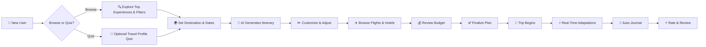
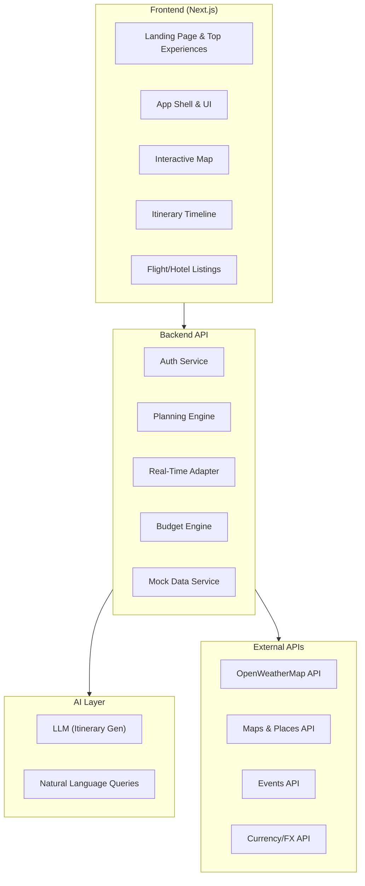

# ⚡ TripPulse — AI-Powered Travel Planning & Experience Engine

## Product Vision

**TripPulse** is an intelligent travel planning platform that dynamically generates, adapts, and optimizes trip itineraries based on traveler preferences, real-world constraints, and live conditions. It goes beyond static trip planners by treating a trip as a **living, evolving plan** — one that reshapes itself as weather shifts, prices fluctuate, crowds surge, or the traveler's mood changes.

---

## The Problem

| Pain Point | Current Reality |
|---|---|
| **Fragmented planning** | Travelers juggle 6-8 tabs — flights, hotels, maps, blogs, weather, reviews — to plan a single trip |
| **Static itineraries** | Plans are "set and forget"; they don't adapt to rain, closures, or spontaneous discoveries |
| **Information overload** | Too many options with no intelligent filtering based on *who you are* |
| **Group coordination** | Planning with friends/family is a nightmare of shared docs and conflicting preferences |
| **Budget blindness** | No unified view of total trip cost that updates in real-time |

---

## Core Product Idea

### 🧠 The Smart Itinerary Engine

An AI engine that takes in:
- **Who** — Solo, couple, family, group (with individual preference profiles)
- **What** — Interests (adventure, culture, food, relaxation, nightlife, photography)
- **When** — Travel dates + flexibility window
- **Where** — Destination(s) or "surprise me"
- **How much** — Budget range (strict vs. flexible)
- **Constraints** — Dietary restrictions, accessibility needs, visa requirements, pet-friendly

...and produces a **minute-by-minute optimized itinerary** that:
- Minimizes transit time between activities
- Respects opening hours, reservation windows, and crowd patterns
- Balances activity intensity (no back-to-back exhausting hikes)
- Adapts in real-time to weather, delays, and user feedback

---

## Key Features

### 1. 🏠 Landing Page — Top Experiences

> *"Inspire before they even search."*

- **Featured destinations** — 8-10 curated destination tiles on the landing page (e.g., Bali, Santorini, Tokyo, Patagonia, Marrakech, Iceland, Amalfi Coast, Kyoto, Cape Town, Swiss Alps)
- **Experience tiles** — Each tile shows: destination image, destination name, and what it's famous for (e.g., "Bali — Rice terraces, temples & surf culture")
- **Quick entry** — Clicking a tile pre-fills the destination and jumps to the itinerary builder
- **Search & filter bar** — Users can also search destinations or filter by: continent, travel style, budget range, best season
- **Trending trips** — Highlight currently popular destinations

### 2. 🎯 Preference DNA — Traveler Profile System

> *"Personalize your trip, your way."*

- **Optional onboarding quiz** — A quick, engaging quiz that maps travel personality (Explorer vs. Relaxer, Foodie vs. Culture Buff, Planner vs. Spontaneous). **Completely optional** — users can skip and go straight to browsing/filtering
- **Filter-first approach** — Users can discover and plan trips purely through filters (destination, dates, budget, interests, travel style) without ever taking the quiz
- **Travel style spectrum** — For users who opt in, sliding scales refine recommendations:
  - Budget ↔ Luxury
  - Touristy ↔ Off-the-beaten-path
  - Packed schedule ↔ Leisure pace
  - Indoor ↔ Outdoor

### 3. 📋 Dynamic Itinerary Builder

> *"A plan that breathes."*

- **Timeline view** — Visual, draggable day-by-day timeline (think Notion meets Google Calendar)
- **Smart suggestions** — AI fills gaps with contextually relevant activities
- **Conflict detection** — Alerts for overlapping bookings, impossible transit times, closed venues
- **Forecast-driven contingencies** — Uses real weather forecast data (via OpenWeatherMap API or similar) to generate smart alternatives:
  - If forecast shows rain → suggest indoor alternatives for that specific time slot
  - If forecast shows extreme cold → don't suggest outdoor dining, suggest warm indoor activities
  - If forecast shows clear skies → prioritize outdoor/scenic activities
  - **No generic assumptions** — contingencies are always tied to actual forecast data for the destination and dates
- **Activity detail cards** — Each activity shows rich contextual information:
  - 🏷️ **Relevant icon** — Type-specific icon (🥾 hiking, 🍽️ dining, 🏛️ museum, 🏖️ beach, etc.)
  - 🌅 **Time of day** — Morning, afternoon, evening, or night indicator
  - ⏱️ **Expected duration** — Estimated time to spend (e.g., "~2 hours")
  - 🔥 **Intensity level** — Low / Medium / High energy indicator
  - 📍 **Distance from previous** — Transit time from the last activity
- **Pacing intelligence** — Automatically balances high-energy and low-energy activities, visible through the intensity indicators
- **Local gems** — Surfaces hidden spots from local data, not just TripAdvisor top-10

### 4. ⚡ Real-Time Adaptation Layer

> *"Plans change. Your trip shouldn't suffer."*

- **Weather-aware rescheduling** — Outdoor activities auto-shift when rain/extreme weather is forecasted (powered by real forecast API data); indoor alternatives surface contextually
- **Live crowd data** — "This museum is packed right now. Visit at 4 PM instead?" 
- **Price tracking** — Flight/hotel price changes trigger re-optimization suggestions and savings alerts
- **Event injection** — Local festivals, pop-up markets, or concerts that align with your interests get suggested
- **Disruption handling** — Flight delays cascade through the itinerary, auto-rebooking alternatives

### 5. 👥 Collaborative Planning (Group Trips)

> *"Everyone gets a vote. No one gets left out."*

- **Shared trip workspace** — Invite travel companions
- **Preference merging** — AI finds the intersection of everyone's preferences
- **Voting system** — Group polls on activities, restaurants, accommodations
- **Split views** — "Your picks vs. Group picks" comparison
- **Budget splitting** — Integrated expense tracking per person

### 6. 💰 Smart Budget Engine

> *"Know exactly what your trip costs — before, during, and after."*

- **Live cost estimation** — Real-time pricing for flights, stays, activities, food, transport
- **Budget allocation** — Visual breakdown: 40% accommodation, 25% food, 20% activities, 15% transport
- **Savings alerts** — "Book this hotel by Thursday to save $120"
- **Currency intelligence** — Auto-conversion with favorable exchange rate tips
- **Cost categories** — Essentials vs. Splurges slider

### 7. ✈️ Flights & Hotels (Dummy Listings)

> *"Everything in one place — no more tab-hopping."*

- **Dummy flight listings** — Show a curated list of flights between origin and destination with realistic pricing, airlines, durations, and layover info (mock data for MVP, real API integration in V2)
- **Dummy hotel listings** — Show hotels near planned activities with ratings, price ranges, amenities, and photos (mock data for MVP)
- **Curated experiences** — Dummy listings of local expert-led experiences (walking tours, cooking classes, adventure activities) tied to the destination, with descriptions, pricing, and ratings

### 8. 🗺️ Interactive Trip Map

> *"See your entire trip at a glance."*

- **Route visualization** — All destinations, stays, and activities plotted with optimized routes
- **Proximity clustering** — Groups nearby activities to minimize travel
- **Neighborhood guides** — Tap any area for curated local insights
- **Offline maps** — Download region maps for use without connectivity
- **Live location** — During the trip, shows "You are here" with next activity directions

### 9. 📸 Experience Journal (Post-Trip)

> *"Your trip, beautifully documented."*

- **Auto-generated travel story** — Photos + locations + notes = a beautiful trip narrative
- **Shareable trip cards** — Social-ready summaries of your trip
- **Review & rate** — Rate activities to improve future recommendations
- **Trip replay** — Animated map showing your journey

---

## Unique Differentiators

| Feature | Typical Planners | TripPulse |
|---|---|---|
| Itinerary generation | Manual or template-based | AI-generated, personalized |
| Real-time updates | ❌ Static | ✅ Weather, crowds, prices |
| Weather handling | Generic tips | Real forecast-driven contingencies |
| Activity details | Name + location only | Icon, time-of-day, duration, intensity |
| Group planning | Shared docs/spreadsheets | Native collaboration with preference merging |
| Budget tracking | Separate apps | Integrated, live-updating |
| Flights & hotels | Redirect to other sites | In-app listings (dummy → real) |
| Adaptability | Fixed plan | Dynamic re-optimization |
| Post-trip | Nothing | Auto-generated travel journal |

---

## User Journey

---

## Technical Architecture (High Level)

---

## MVP Scope (V1) — What to Build First

> [!IMPORTANT]
> The MVP should demonstrate the **core magic** — intelligent itinerary generation that feels personal, with real weather data and comprehensive trip info — without building real booking integrations.

### ✅ In Scope for V1

| Feature | Priority |
|---|---|
| Landing page with 8-10 top experience tiles | 🔴 P0 |
| Search & filter (destination, dates, budget, style) | 🔴 P0 |
| Optional travel profile quiz | 🔴 P0 |
| AI itinerary generation (single destination) | 🔴 P0 |
| Interactive timeline view (drag & drop) | 🔴 P0 |
| Activity detail cards (icon, time-of-day, duration, intensity) | 🔴 P0 |
| Interactive map with plotted activities | 🔴 P0 |
| Weather-aware suggestions (real forecast API) | 🔴 P0 |
| Budget estimation & breakdown | 🔴 P0 |
| Real-time price tracking & alerts | 🔴 P0 |
| Dummy flight listings (origin ↔ destination) | 🔴 P0 |
| Dummy hotel listings (near activities) | 🔴 P0 |
| Dummy curated local experiences | 🔴 P0 |
| Save itinerary | 🔴 P0 |
| Share itinerary (link) | 🟡 P1 |

### ❌ Deferred to V2+

| Feature | Version |
|---|---|
| Group collaboration & voting | V2 |
| Offline maps & trip mode | V2 |
| Post-trip journal & social sharing | V2 |
| Real flight/hotel API integration (replacing dummy data) | V2 |
| Multi-destination trip chaining | V3 |

---

## Next Steps

> [!TIP]
> Ready to build! I can create a detailed implementation plan with component architecture, database schema, API design, and start coding the prototype.

1. **Confirm tech stack** — Next.js + database + AI provider preferences
2. **Design the UI** — Generate mockups for landing page, itinerary builder, activity cards
3. **Build the MVP** — Start with the landing page and itinerary engine core
